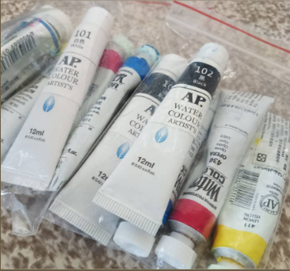

# README

在本論文中，我們利用網路攝影機視訊流和聚類算法的結合，以辨識現實並捕捉水彩顏色。透過這種技術，我們希望能夠在色盤中自動化選取目標顏色，以及調色，並實現顏色繪製。希望這項研究在機器人藝術、創意設計和工業應用等領域帶給另一種思考模式，帶來創作和創新成果。

## 研究動機&目的

機器手臂繪製是一個常見的議題，除了藝術家們躍躍欲試不同的機器人創作外，科技人員同時藉此提升視覺技術、硬體機構的設計、人工智慧與機器學習等領域的深度整合，這種整合開發除了面對藝術家的藝術創作領域受惠外，同等知識經驗也可以帶回到工業與製造業領域，再一次突破製造生產的限制困境與加大技術革新的目的。

在機械手臂繪製研究中，大部分研究以產出優化路徑來驅動機械手臂依據所規畫 路徑繪製圖形動作，不管是將圖片做二值化處理在透過邊緣運算規劃路徑或是利用對 抗網路 (GAN) 來產生圖片再進行路徑處理。只有少部分提及到視覺與現實色採的整合應用，比如何如判斷顏料顏色來進行色彩調色以及將最終目標顏色進行圖片路徑上色等，要想進行顏色繪製的研究是需要運用現實的色彩學理論。

## 硬體配置

### 硬體配置

- 桌上手臂為大象機器人的ultraArm P340，該手臂是基於開源技術的協作機器臂，採用鋁合金結構，基板適用Arduino開發板ATMEGA2560-16AU AVR處理器，一體化的設計，操作簡單，提供激光雕刻接口、自適應夾爪接口、吸泵接口、燒錄開關輕鬆切換，手臂是由兩顆步進馬達所組成，利用連桿機構來進行三軸方向運動。
- 我們所使用的羅技視訊攝影機C922 Pro HD Steam Webcam具有多種功能和特點，故此成為本實驗的選擇視覺設備。
- 電腦硬件為GF63 8RD，CPU為i7-8750H，GPU為GTX1050。

### 軟體配置

- Window 10 作業系統。
- Python 版本為3.8.5。
- OpenCV-Python 版本為 4.8.1.78。
- T****kinter**** 版本為0.1.0。
- ultraArm SDK 版本為3.2.0。

### 繪圖區配置

- 機械手臂的工作範圍最高為 340mm。
- 圖畫尺寸 為 95mm x 95mm。
- 調色板，放置在圖畫區的左側，大小為 6mm x 12.4mm。
- 圖畫區右側準備了一個小杯子作為清洗顏料和用水的容器。

## 相關研究

### 集群分析 K-means Clustering

- 透過將數據點劃分到 K 個聚類中心，它能有效實現聚類。算法的目標是最小化聚類內的平方誤差和，進而使得每個數據點與所屬聚類中心的距離之和最小。
- 工作方式 : 初始化→分配數據點→更新聚類中心→重複迭代。

{width=50%}

### 形態學骨架 Morphological Skeleton

- 通過從圖像中萃取物體的骨架，我們能夠精煉資訊、節省儲存空間，同時保留主要形狀和結構特徵。
- 在形態學骨架的過程中 ，我們首先將圖像中的物體進行二值化，然後，我們根據特定的操作步改變物體的形狀，直到獲得物體的中心線或骨架結構。

{width=50%}

{width=50%}

## 研究方法

### 顏色判斷

- 使用K-means做顏色判定以後，將RGB 值轉換為 HSV（色相、飽和度、明度）顏色空間格式。
- 設定 8 種顏色，我們將飽和度和明度的範圍設定為 50 至 255 的數值。較低的飽和度值使顏色趨近 於白色，而較低的明度值使顏色趨向於黑色。

{width=50%}

### 路徑生成

- 使用線稿和著色後的色彩稿來對比、分解為不同的區塊，並根據需要進行著色。
- 對於每個需要著色的區塊，我們進行顏色分析和分類，識別出區塊中存在的不同顏色。
- 使用斜線群做為基底，並找出範圍線段與斜線群的交點來生成著色路徑。

{width=50%}

### 系統流程

- 顏色判斷→圖形路徑生成→自動繪畫。

{width=50%}

{width=50%}

### 界面設計

- 手臂控制分頁、圖紙狀況分頁、調色盤狀況分頁。

{width=50%}

## 實驗結果

- 使用三張圖來做實驗測試。

{width=50%}

{width=50%}

{width=50%}

## 缺點

- 簡易的斜線群路徑。
- 無充分呈現水彩多層次疊加。
- 顏色判斷時常失誤。
- 手工補料，無法判定取色份量。